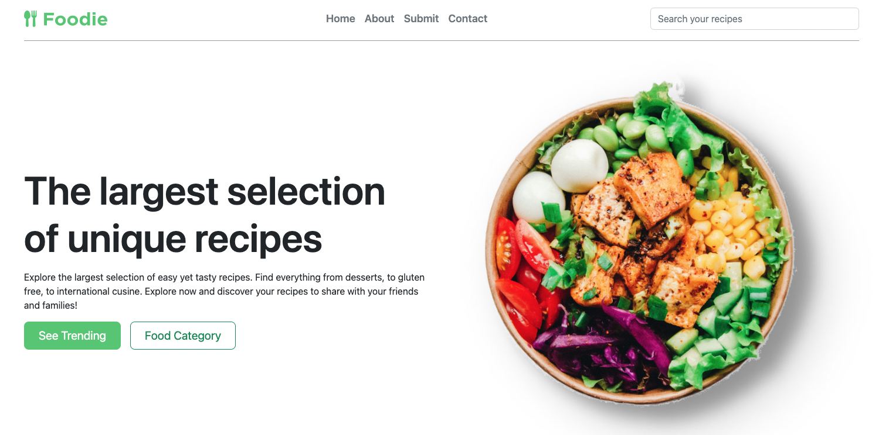
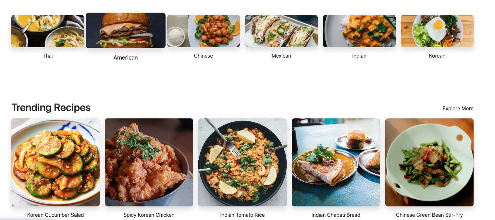
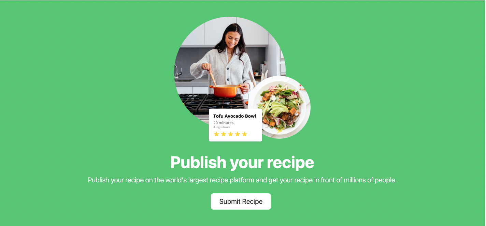

# **Foodie**

## Table of Contents

- [Description](#Description)
- [User Story](#user-story)
- [Getting Started](#getting-started)
- [Technologies](#technologies)
- [API](#API)
- [Future Improvements](#future-improvements)

## Description

---

Looking to find your favorite recipe? you came to the right place!

## Wireframe

---

Here is the wireframe that I used to structure the recipe-blog web application.

Deployed Website:https://recipe-blog-awesome.herokuapp.com/

## User Story

---

Foodie is a recipe repository that allows users to search for delicious recipes. User can browse trending recipes, browse for recipes by category, or search for recipes by keyword. Users are also able to upload their own recipes, edit them, and delete them.

## Getting Started

---

Post your favorite recipes on the submit page.

## Technologies

---

- Node.js
- Express
- MongoDB
- Mongoose
- Boostrap
- CSS
- EJS
- Figma
- Google Fonts

## Future Improvements

---

For future improvements I will include...

- create about page
- create contact me page
- create upload image section and save those uploaded images unto a folder when the recipes are created
